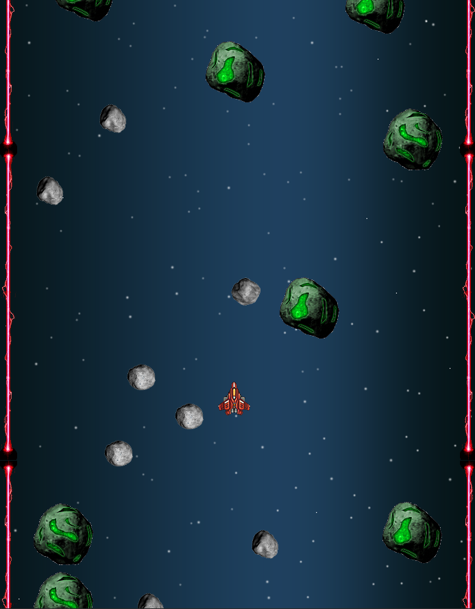
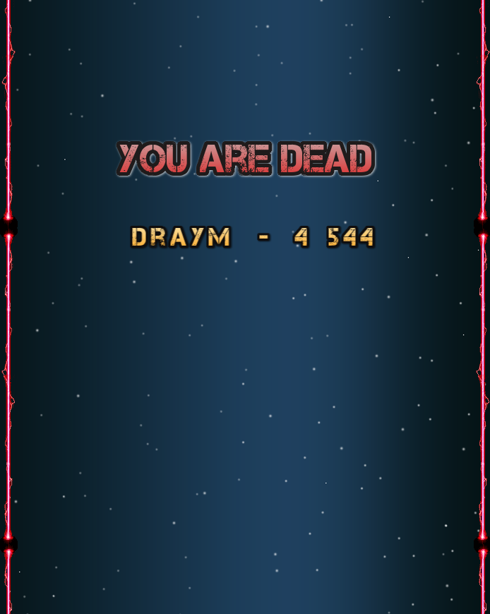
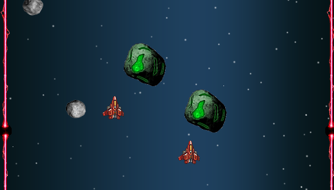

-------------------------------------------------------------------------------------------  

**Adaptation of the famous spaceship arcade games. Abroad your spaceship survive within an asteroid field.**

SpaceDodger is the first game i have created in Java, i have made it on my spare time while i was learning Java at university. I believe slick2d and game creation is one of the reason why i greatly love jvm and OOP concentps, as i discovered it in the most funny way possible.

I have created it entierly myself from scratch.
I have used external resources for :
- Slick2D : basic java 2D rendering library
- sprite sheets from internet
- musics from internet

-------------------------------------------------------------------------------------------  
## Gameplay:  

The goal of this game is to survive the longuest time possible. The more you survive, the more you earn points. Who will achieve the highest score ? 🚀

You will encounter a series of obstacle 👾 one hit and you are dead!

The asteroids are created in a random manners to create replayability and the dificulty will increase over time. In any cases, a path will be available for you to pass through.
You will have to use world level dexterity and timing to reach the highest score 🥇

  

-------------------------------------------------------------------------------------------  
## Features:

- survival game with random patterns
- solo or duo mode available
- earn more points with asteroid's interaction, the closer you are the more your earn 💎

 
